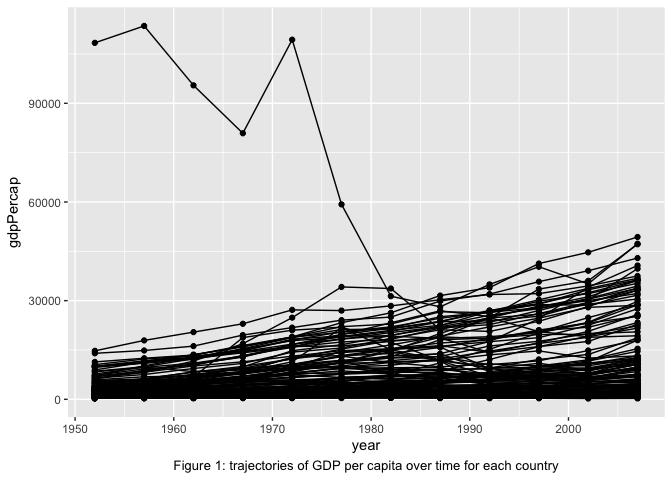
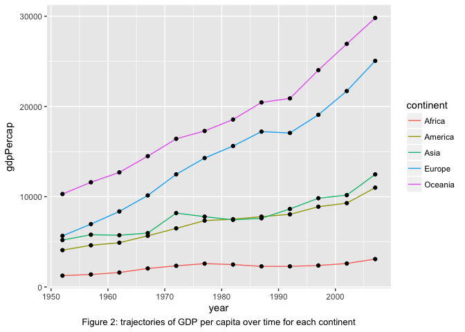
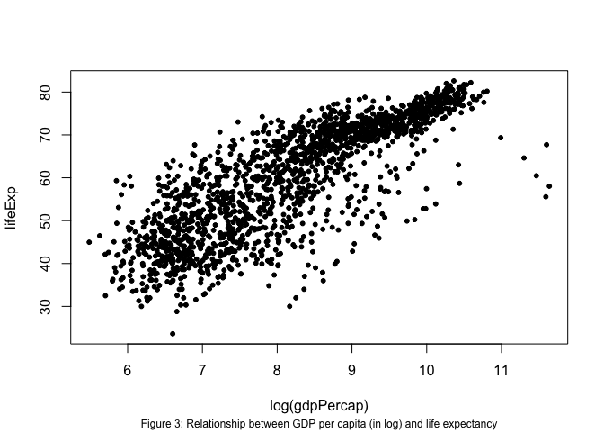

Gapminder Exploration
================
Sihaoyu Gao

-   [1. Introduction](#introduction)
-   [2. Analysis](#analysis)
    -   [2.1 GDP per capita change for countries](#gdp-per-capita-change-for-countries)
    -   [2.2 GDP per capita change for continents](#gdp-per-capita-change-for-continents)
    -   [2.3 GDP per capita vs. life expectancy](#gdp-per-capita-vs.-life-expectancy)

## 1. Introduction

This document explores the gapminder dataset. First of all, load the gapminder data set from `gapminder` library. Before doing any analysis, we need to understand the dataset. The data set is the excerpt of the Gapminder data on life expectancy, GDP per capita, and population by country. The main data frame gapminder has 1704 rows and 6 variables:

``` r
names(gapminder)
```

    [1] "country"  
    [2] "continent"
    [3] "year"     
    [4] "lifeExp"  
    [5] "pop"      
    [6] "gdpPercap"

Country is a factor with 142 levels, continent is a factor with 5 levels, year ranges from 1952 to 2007 in increments of 5 years, lifeExp is life expectancy at birth (in years), pop is population, and gdpPercap is GDP per capita in US dollars. All the above information are provided in R.

``` r
?gapminder
```

## 2. Analysis

### 2.1 GDP per capita change for countries

Figure 1 shows the trajectories of GDP per capita over time for each country. There is one country had an extremely high GDP per capita before 1980. By extracting the lines with remarkable high GDP from the dataset, it shows that the outstanding country is Kuwait in Asia.



The change in GDP per capita over time for each country can also be summarized by number.

<table>
<caption>
Table 1: Countries with the most and the least increase in GDP per capita
</caption>
<thead>
<tr>
<th style="text-align:center;">
Comment
</th>
<th style="text-align:center;">
country
</th>
<th style="text-align:center;">
continent
</th>
<th style="text-align:center;">
GDP change
</th>
</tr>
</thead>
<tbody>
<tr>
<td style="text-align:center;">
most increase
</td>
<td style="text-align:center;">
Singapore
</td>
<td style="text-align:center;">
Asia
</td>
<td style="text-align:center;">
44828.0414
</td>
</tr>
<tr>
<td style="text-align:center;">
</td>
<td style="text-align:center;">
Norway
</td>
<td style="text-align:center;">
Europe
</td>
<td style="text-align:center;">
39261.7685
</td>
</tr>
<tr>
<td style="text-align:center;">
least increase
</td>
<td style="text-align:center;">
Kuwait
</td>
<td style="text-align:center;">
Asia
</td>
<td style="text-align:center;">
-61075.3631
</td>
</tr>
<tr>
<td style="text-align:center;">
</td>
<td style="text-align:center;">
Haiti
</td>
<td style="text-align:center;">
Americas
</td>
<td style="text-align:center;">
-638.7298
</td>
</tr>
</tbody>
</table>
As shown in Table 1, Singapore in Asia had the greatest increase in GDP per capital over 55 years, followed by Norway in Europe. Singapore had an increase of 44828.04 in GDP per capital, while Norway increased 39261.77. As we have already seen that Kuwait in Asia had a huge decrease in GDP per capital for about 61075.3631, followed by Haiti in Americas with 638.7298 decrease in GDP per capital over 55 years.

### 2.2 GDP per capita change for continents

Except show all 142 countries' change in GDP per capita over time, we can also plot the GDP per capita change in terms of different continents. Figure 2 shows the trajectories of GDP per capita over time for each continent. At each time point, GDP per capita for each continent is calculated by the mean of all the countries in the continent at that time point. From Figure 2, we can see that Europe and Oceania had the fastest increase rate of GDP per capita, while Africa had the lowest increase rate of GDP per capita over years.



### 2.3 GDP per capita vs. life expectancy

Finally, instead of showing the GDP per capita change over time, it is interesting to explore the relationship between GDP per capita and life expectancy. From Figure 3, it is obvious that life expectancy increases as GDP per capita increases.



The correlation coefficient also indicates the same result. 0.8 is quite close to 1, and it illustrates that life expectancy and GDP per capita (in log) have a positive correlation.

``` r
cor(log(gdpPercap),lifeExp)
```

    [1] 0.8076179
