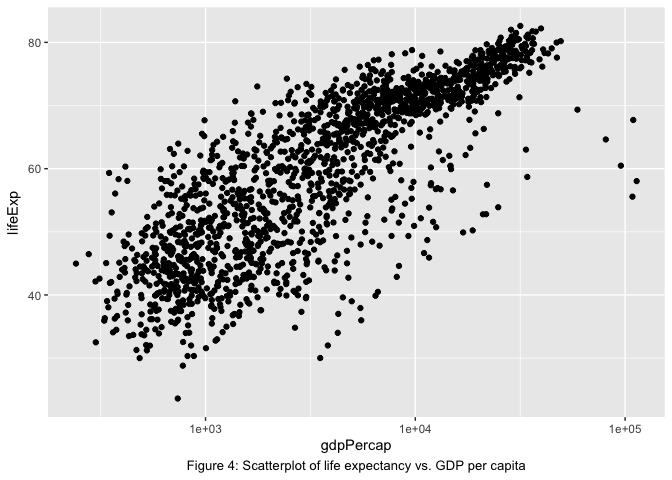

Explore Gapminder and use dplyr
================
Sihaoyu Gao

-   [Exercise 1: Basic `dplyr`](#exercise-1-basic-dplyr)
    -   [1.1 Use `filter()` to subset the `gapminder` data to three countries of your choice in the 1970’s.](#use-filter-to-subset-the-gapminder-data-to-three-countries-of-your-choice-in-the-1970s.)
    -   [1.2 Use the pipe operator `%>%` to select “country” and “gdpPercap” from your filtered dataset in 1.1.](#use-the-pipe-operator-to-select-country-and-gdppercap-from-your-filtered-dataset-in-1.1.)
    -   [1.3 Filter gapminder to all entries that have experienced a drop in life expectancy.](#filter-gapminder-to-all-entries-that-have-experienced-a-drop-in-life-expectancy.)
    -   [1.4 Filter gapminder so that it shows the max GDP per capita experienced by each country.](#filter-gapminder-so-that-it-shows-the-max-gdp-per-capita-experienced-by-each-country.)
    -   [1.5 Produce a scatterplot of Canada’s life expectancy vs. GDP per capita using `ggplot2`, without defining a new variable. Ensure GDP per capita is on a log scale.](#produce-a-scatterplot-of-canadas-life-expectancy-vs.-gdp-per-capita-using-ggplot2-without-defining-a-new-variable.-ensure-gdp-per-capita-is-on-a-log-scale.)
-   [Exercise 2: Explore individual variables with `dplyr`](#exercise-2-explore-individual-variables-with-dplyr)
    -   [2.1 What are possible values (or range, whichever is appropriate) of each variable?](#what-are-possible-values-or-range-whichever-is-appropriate-of-each-variable)
    -   [2.2 What values are typical? What’s the spread? What’s the distribution? Etc., tailored to the variable at hand.](#what-values-are-typical-whats-the-spread-whats-the-distribution-etc.-tailored-to-the-variable-at-hand.)
-   [Exercise 3: Explore various plot types](#exercise-3-explore-various-plot-types)
    -   [3.1 A scatterplot of two quantitative variables.](#a-scatterplot-of-two-quantitative-variables.)
    -   [3.2 One other plot besides a scatterplot.](#one-other-plot-besides-a-scatterplot.)
-   [Optional: Recycling](#optional-recycling)

Exercise 1: Basic `dplyr`
-------------------------

### 1.1 Use `filter()` to subset the `gapminder` data to three countries of your choice in the 1970’s.

``` r
gapminder1 <- gapminder %>%
  filter(year <= 1979 & year >= 1970,
         country=='China' | country== 'Canada' | country == 'Japan') 
kable(gapminder1)
```

<table>
<thead>
<tr>
<th style="text-align:left;">
country
</th>
<th style="text-align:left;">
continent
</th>
<th style="text-align:right;">
year
</th>
<th style="text-align:right;">
lifeExp
</th>
<th style="text-align:right;">
pop
</th>
<th style="text-align:right;">
gdpPercap
</th>
</tr>
</thead>
<tbody>
<tr>
<td style="text-align:left;">
Canada
</td>
<td style="text-align:left;">
Americas
</td>
<td style="text-align:right;">
1972
</td>
<td style="text-align:right;">
72.88000
</td>
<td style="text-align:right;">
22284500
</td>
<td style="text-align:right;">
18970.5709
</td>
</tr>
<tr>
<td style="text-align:left;">
Canada
</td>
<td style="text-align:left;">
Americas
</td>
<td style="text-align:right;">
1977
</td>
<td style="text-align:right;">
74.21000
</td>
<td style="text-align:right;">
23796400
</td>
<td style="text-align:right;">
22090.8831
</td>
</tr>
<tr>
<td style="text-align:left;">
China
</td>
<td style="text-align:left;">
Asia
</td>
<td style="text-align:right;">
1972
</td>
<td style="text-align:right;">
63.11888
</td>
<td style="text-align:right;">
862030000
</td>
<td style="text-align:right;">
676.9001
</td>
</tr>
<tr>
<td style="text-align:left;">
China
</td>
<td style="text-align:left;">
Asia
</td>
<td style="text-align:right;">
1977
</td>
<td style="text-align:right;">
63.96736
</td>
<td style="text-align:right;">
943455000
</td>
<td style="text-align:right;">
741.2375
</td>
</tr>
<tr>
<td style="text-align:left;">
Japan
</td>
<td style="text-align:left;">
Asia
</td>
<td style="text-align:right;">
1972
</td>
<td style="text-align:right;">
73.42000
</td>
<td style="text-align:right;">
107188273
</td>
<td style="text-align:right;">
14778.7864
</td>
</tr>
<tr>
<td style="text-align:left;">
Japan
</td>
<td style="text-align:left;">
Asia
</td>
<td style="text-align:right;">
1977
</td>
<td style="text-align:right;">
75.38000
</td>
<td style="text-align:right;">
113872473
</td>
<td style="text-align:right;">
16610.3770
</td>
</tr>
</tbody>
</table>
### 1.2 Use the pipe operator `%>%` to select “country” and “gdpPercap” from your filtered dataset in 1.1.

``` r
gapminder2 <- gapminder1 %>% 
  select(country,gdpPercap)
kable(gapminder2)
```

<table>
<thead>
<tr>
<th style="text-align:left;">
country
</th>
<th style="text-align:right;">
gdpPercap
</th>
</tr>
</thead>
<tbody>
<tr>
<td style="text-align:left;">
Canada
</td>
<td style="text-align:right;">
18970.5709
</td>
</tr>
<tr>
<td style="text-align:left;">
Canada
</td>
<td style="text-align:right;">
22090.8831
</td>
</tr>
<tr>
<td style="text-align:left;">
China
</td>
<td style="text-align:right;">
676.9001
</td>
</tr>
<tr>
<td style="text-align:left;">
China
</td>
<td style="text-align:right;">
741.2375
</td>
</tr>
<tr>
<td style="text-align:left;">
Japan
</td>
<td style="text-align:right;">
14778.7864
</td>
</tr>
<tr>
<td style="text-align:left;">
Japan
</td>
<td style="text-align:right;">
16610.3770
</td>
</tr>
</tbody>
</table>
### 1.3 Filter gapminder to all entries that have experienced a drop in life expectancy.

There are 102 entires that have experienced a drop in life expectancy compared to their last entry (for the same country). The table shows the first 10 such entries.

``` r
gapminder3<-gapminder %>% 
  mutate(increaselifeExp = gapminder$lifeExp-lag(gapminder$lifeExp,1)) %>% 
  filter(year != 1952,
         increaselifeExp < 0)
kable(gapminder3[1:10,])
```

<table>
<thead>
<tr>
<th style="text-align:left;">
country
</th>
<th style="text-align:left;">
continent
</th>
<th style="text-align:right;">
year
</th>
<th style="text-align:right;">
lifeExp
</th>
<th style="text-align:right;">
pop
</th>
<th style="text-align:right;">
gdpPercap
</th>
<th style="text-align:right;">
increaselifeExp
</th>
</tr>
</thead>
<tbody>
<tr>
<td style="text-align:left;">
Albania
</td>
<td style="text-align:left;">
Europe
</td>
<td style="text-align:right;">
1992
</td>
<td style="text-align:right;">
71.581
</td>
<td style="text-align:right;">
3326498
</td>
<td style="text-align:right;">
2497.4379
</td>
<td style="text-align:right;">
-0.419
</td>
</tr>
<tr>
<td style="text-align:left;">
Angola
</td>
<td style="text-align:left;">
Africa
</td>
<td style="text-align:right;">
1987
</td>
<td style="text-align:right;">
39.906
</td>
<td style="text-align:right;">
7874230
</td>
<td style="text-align:right;">
2430.2083
</td>
<td style="text-align:right;">
-0.036
</td>
</tr>
<tr>
<td style="text-align:left;">
Benin
</td>
<td style="text-align:left;">
Africa
</td>
<td style="text-align:right;">
2002
</td>
<td style="text-align:right;">
54.406
</td>
<td style="text-align:right;">
7026113
</td>
<td style="text-align:right;">
1372.8779
</td>
<td style="text-align:right;">
-0.371
</td>
</tr>
<tr>
<td style="text-align:left;">
Botswana
</td>
<td style="text-align:left;">
Africa
</td>
<td style="text-align:right;">
1992
</td>
<td style="text-align:right;">
62.745
</td>
<td style="text-align:right;">
1342614
</td>
<td style="text-align:right;">
7954.1116
</td>
<td style="text-align:right;">
-0.877
</td>
</tr>
<tr>
<td style="text-align:left;">
Botswana
</td>
<td style="text-align:left;">
Africa
</td>
<td style="text-align:right;">
1997
</td>
<td style="text-align:right;">
52.556
</td>
<td style="text-align:right;">
1536536
</td>
<td style="text-align:right;">
8647.1423
</td>
<td style="text-align:right;">
-10.189
</td>
</tr>
<tr>
<td style="text-align:left;">
Botswana
</td>
<td style="text-align:left;">
Africa
</td>
<td style="text-align:right;">
2002
</td>
<td style="text-align:right;">
46.634
</td>
<td style="text-align:right;">
1630347
</td>
<td style="text-align:right;">
11003.6051
</td>
<td style="text-align:right;">
-5.922
</td>
</tr>
<tr>
<td style="text-align:left;">
Bulgaria
</td>
<td style="text-align:left;">
Europe
</td>
<td style="text-align:right;">
1977
</td>
<td style="text-align:right;">
70.810
</td>
<td style="text-align:right;">
8797022
</td>
<td style="text-align:right;">
7612.2404
</td>
<td style="text-align:right;">
-0.090
</td>
</tr>
<tr>
<td style="text-align:left;">
Bulgaria
</td>
<td style="text-align:left;">
Europe
</td>
<td style="text-align:right;">
1992
</td>
<td style="text-align:right;">
71.190
</td>
<td style="text-align:right;">
8658506
</td>
<td style="text-align:right;">
6302.6234
</td>
<td style="text-align:right;">
-0.150
</td>
</tr>
<tr>
<td style="text-align:left;">
Bulgaria
</td>
<td style="text-align:left;">
Europe
</td>
<td style="text-align:right;">
1997
</td>
<td style="text-align:right;">
70.320
</td>
<td style="text-align:right;">
8066057
</td>
<td style="text-align:right;">
5970.3888
</td>
<td style="text-align:right;">
-0.870
</td>
</tr>
<tr>
<td style="text-align:left;">
Burundi
</td>
<td style="text-align:left;">
Africa
</td>
<td style="text-align:right;">
1992
</td>
<td style="text-align:right;">
44.736
</td>
<td style="text-align:right;">
5809236
</td>
<td style="text-align:right;">
631.6999
</td>
<td style="text-align:right;">
-3.475
</td>
</tr>
</tbody>
</table>
### 1.4 Filter gapminder so that it shows the max GDP per capita experienced by each country.

There are 142 countries in gapminder data. The table only shows 10 countries with their max GDP per capita,

``` r
gapminder4 <- gapminder %>% 
  group_by(country) %>% 
  filter(gdpPercap == max(gdpPercap))
kable(gapminder4[1:10,])
```

<table>
<thead>
<tr>
<th style="text-align:left;">
country
</th>
<th style="text-align:left;">
continent
</th>
<th style="text-align:right;">
year
</th>
<th style="text-align:right;">
lifeExp
</th>
<th style="text-align:right;">
pop
</th>
<th style="text-align:right;">
gdpPercap
</th>
</tr>
</thead>
<tbody>
<tr>
<td style="text-align:left;">
Afghanistan
</td>
<td style="text-align:left;">
Asia
</td>
<td style="text-align:right;">
1982
</td>
<td style="text-align:right;">
39.854
</td>
<td style="text-align:right;">
12881816
</td>
<td style="text-align:right;">
978.0114
</td>
</tr>
<tr>
<td style="text-align:left;">
Albania
</td>
<td style="text-align:left;">
Europe
</td>
<td style="text-align:right;">
2007
</td>
<td style="text-align:right;">
76.423
</td>
<td style="text-align:right;">
3600523
</td>
<td style="text-align:right;">
5937.0295
</td>
</tr>
<tr>
<td style="text-align:left;">
Algeria
</td>
<td style="text-align:left;">
Africa
</td>
<td style="text-align:right;">
2007
</td>
<td style="text-align:right;">
72.301
</td>
<td style="text-align:right;">
33333216
</td>
<td style="text-align:right;">
6223.3675
</td>
</tr>
<tr>
<td style="text-align:left;">
Angola
</td>
<td style="text-align:left;">
Africa
</td>
<td style="text-align:right;">
1967
</td>
<td style="text-align:right;">
35.985
</td>
<td style="text-align:right;">
5247469
</td>
<td style="text-align:right;">
5522.7764
</td>
</tr>
<tr>
<td style="text-align:left;">
Argentina
</td>
<td style="text-align:left;">
Americas
</td>
<td style="text-align:right;">
2007
</td>
<td style="text-align:right;">
75.320
</td>
<td style="text-align:right;">
40301927
</td>
<td style="text-align:right;">
12779.3796
</td>
</tr>
<tr>
<td style="text-align:left;">
Australia
</td>
<td style="text-align:left;">
Oceania
</td>
<td style="text-align:right;">
2007
</td>
<td style="text-align:right;">
81.235
</td>
<td style="text-align:right;">
20434176
</td>
<td style="text-align:right;">
34435.3674
</td>
</tr>
<tr>
<td style="text-align:left;">
Austria
</td>
<td style="text-align:left;">
Europe
</td>
<td style="text-align:right;">
2007
</td>
<td style="text-align:right;">
79.829
</td>
<td style="text-align:right;">
8199783
</td>
<td style="text-align:right;">
36126.4927
</td>
</tr>
<tr>
<td style="text-align:left;">
Bahrain
</td>
<td style="text-align:left;">
Asia
</td>
<td style="text-align:right;">
2007
</td>
<td style="text-align:right;">
75.635
</td>
<td style="text-align:right;">
708573
</td>
<td style="text-align:right;">
29796.0483
</td>
</tr>
<tr>
<td style="text-align:left;">
Bangladesh
</td>
<td style="text-align:left;">
Asia
</td>
<td style="text-align:right;">
2007
</td>
<td style="text-align:right;">
64.062
</td>
<td style="text-align:right;">
150448339
</td>
<td style="text-align:right;">
1391.2538
</td>
</tr>
<tr>
<td style="text-align:left;">
Belgium
</td>
<td style="text-align:left;">
Europe
</td>
<td style="text-align:right;">
2007
</td>
<td style="text-align:right;">
79.441
</td>
<td style="text-align:right;">
10392226
</td>
<td style="text-align:right;">
33692.6051
</td>
</tr>
</tbody>
</table>
### 1.5 Produce a scatterplot of Canada’s life expectancy vs. GDP per capita using `ggplot2`, without defining a new variable. Ensure GDP per capita is on a log scale.

``` r
gapminder %>% 
  filter(country=="Canada") %>% 
  ggplot(aes(x = gdpPercap, y = lifeExp)) + geom_point() +
  labs(y="Life Expectancy", x="GDP per capita on a log10 scale") +
  scale_x_continuous(trans='log10')+
  theme_bw()+labs(caption = "Figure 1: scatterplot of Canada’s life expectancy vs. GDP per capita") + 
  theme(plot.caption = element_text(hjust = 0.5))
```


Exercise 2: Explore individual variables with `dplyr`
-----------------------------------------------------

Pick one categorical variable and one quantitative variable to explore. Answer the following questions in whichever way you think is appropriate, using `dplyr`:

### 2.1 What are possible values (or range, whichever is appropriate) of each variable?

I will explore continent and GDP per capital in this section. As shown in table, There are 5 continents in the dataset, which are Africa, Americas, Aisa, Europe, and Oceania. By counting number of countries in each continent, there are 52 countries collected in Africa and only 2 countries collected in Oceania.

<table>
<thead>
<tr>
<th style="text-align:left;">
continent
</th>
<th style="text-align:right;">
numcountries
</th>
</tr>
</thead>
<tbody>
<tr>
<td style="text-align:left;">
Africa
</td>
<td style="text-align:right;">
52
</td>
</tr>
<tr>
<td style="text-align:left;">
Americas
</td>
<td style="text-align:right;">
25
</td>
</tr>
<tr>
<td style="text-align:left;">
Asia
</td>
<td style="text-align:right;">
33
</td>
</tr>
<tr>
<td style="text-align:left;">
Europe
</td>
<td style="text-align:right;">
30
</td>
</tr>
<tr>
<td style="text-align:left;">
Oceania
</td>
<td style="text-align:right;">
2
</td>
</tr>
</tbody>
</table>
Next, I calculate the range of GDP per capita in terms of different continents. As shown in table, Asia has the widest range of GDP per capita, which is 113192.13, while Africa has the most narrow range of GDP per capita, which is 21710.05.

<table>
<thead>
<tr>
<th style="text-align:left;">
continent
</th>
<th style="text-align:right;">
mingdpPercap
</th>
<th style="text-align:right;">
maxgdpPercap
</th>
<th style="text-align:right;">
rangegdpPercap
</th>
</tr>
</thead>
<tbody>
<tr>
<td style="text-align:left;">
Africa
</td>
<td style="text-align:right;">
241.1659
</td>
<td style="text-align:right;">
21951.21
</td>
<td style="text-align:right;">
21710.05
</td>
</tr>
<tr>
<td style="text-align:left;">
Oceania
</td>
<td style="text-align:right;">
10039.5956
</td>
<td style="text-align:right;">
34435.37
</td>
<td style="text-align:right;">
24395.77
</td>
</tr>
<tr>
<td style="text-align:left;">
Americas
</td>
<td style="text-align:right;">
1201.6372
</td>
<td style="text-align:right;">
42951.65
</td>
<td style="text-align:right;">
41750.02
</td>
</tr>
<tr>
<td style="text-align:left;">
Europe
</td>
<td style="text-align:right;">
973.5332
</td>
<td style="text-align:right;">
49357.19
</td>
<td style="text-align:right;">
48383.66
</td>
</tr>
<tr>
<td style="text-align:left;">
Asia
</td>
<td style="text-align:right;">
331.0000
</td>
<td style="text-align:right;">
113523.13
</td>
<td style="text-align:right;">
113192.13
</td>
</tr>
</tbody>
</table>
### 2.2 What values are typical? What’s the spread? What’s the distribution? Etc., tailored to the variable at hand.

As shown in the previous table, we can see that Asia contains an extremely high GDP per capita compared to other continent, which is 113523.13. We can show the spread of GDP per capita with respect to different continents by using side-by-side boxplots. The GDP per capita is drawn on log scale.


The overall distribution of GDP per capita is displayed in figure 3. The GDP per capita is also on log scale. We can see that the GDP per capita follows a bimodal distribution, with slightly right skewed tail.


Exercise 3: Explore various plot types
--------------------------------------

### 3.1 A scatterplot of two quantitative variables.

Someone may interested in exploring the relationship between GDP per capita and life expectancy. From figure 4, it is obvious that life expectancy increases as GDP per capita increases.



### 3.2 One other plot besides a scatterplot.

The following plot demonstrates the GDP per capita change in terms of different continents. At each time point, GDP per capita for each continent is calculated by the mean of all the countries in the continent at that time point. From figure 5, we can see that Europe and Oceania had the fastest increase rate of GDP per capita, while Africa had the lowest increase rate of GDP per capita over years.


Optional: Recycling
-------------------

Evaluate this code and describe the result. Presumably the analyst’s intent was to get the data for Rwanda and Afghanistan. Did they succeed? Why or why not? If not, what is the correct way to do this?

``` r
kable(filter(gapminder, country == c("Rwanda", "Afghanistan")))
```

<table>
<thead>
<tr>
<th style="text-align:left;">
country
</th>
<th style="text-align:left;">
continent
</th>
<th style="text-align:right;">
year
</th>
<th style="text-align:right;">
lifeExp
</th>
<th style="text-align:right;">
pop
</th>
<th style="text-align:right;">
gdpPercap
</th>
</tr>
</thead>
<tbody>
<tr>
<td style="text-align:left;">
Afghanistan
</td>
<td style="text-align:left;">
Asia
</td>
<td style="text-align:right;">
1957
</td>
<td style="text-align:right;">
30.332
</td>
<td style="text-align:right;">
9240934
</td>
<td style="text-align:right;">
820.8530
</td>
</tr>
<tr>
<td style="text-align:left;">
Afghanistan
</td>
<td style="text-align:left;">
Asia
</td>
<td style="text-align:right;">
1967
</td>
<td style="text-align:right;">
34.020
</td>
<td style="text-align:right;">
11537966
</td>
<td style="text-align:right;">
836.1971
</td>
</tr>
<tr>
<td style="text-align:left;">
Afghanistan
</td>
<td style="text-align:left;">
Asia
</td>
<td style="text-align:right;">
1977
</td>
<td style="text-align:right;">
38.438
</td>
<td style="text-align:right;">
14880372
</td>
<td style="text-align:right;">
786.1134
</td>
</tr>
<tr>
<td style="text-align:left;">
Afghanistan
</td>
<td style="text-align:left;">
Asia
</td>
<td style="text-align:right;">
1987
</td>
<td style="text-align:right;">
40.822
</td>
<td style="text-align:right;">
13867957
</td>
<td style="text-align:right;">
852.3959
</td>
</tr>
<tr>
<td style="text-align:left;">
Afghanistan
</td>
<td style="text-align:left;">
Asia
</td>
<td style="text-align:right;">
1997
</td>
<td style="text-align:right;">
41.763
</td>
<td style="text-align:right;">
22227415
</td>
<td style="text-align:right;">
635.3414
</td>
</tr>
<tr>
<td style="text-align:left;">
Afghanistan
</td>
<td style="text-align:left;">
Asia
</td>
<td style="text-align:right;">
2007
</td>
<td style="text-align:right;">
43.828
</td>
<td style="text-align:right;">
31889923
</td>
<td style="text-align:right;">
974.5803
</td>
</tr>
<tr>
<td style="text-align:left;">
Rwanda
</td>
<td style="text-align:left;">
Africa
</td>
<td style="text-align:right;">
1952
</td>
<td style="text-align:right;">
40.000
</td>
<td style="text-align:right;">
2534927
</td>
<td style="text-align:right;">
493.3239
</td>
</tr>
<tr>
<td style="text-align:left;">
Rwanda
</td>
<td style="text-align:left;">
Africa
</td>
<td style="text-align:right;">
1962
</td>
<td style="text-align:right;">
43.000
</td>
<td style="text-align:right;">
3051242
</td>
<td style="text-align:right;">
597.4731
</td>
</tr>
<tr>
<td style="text-align:left;">
Rwanda
</td>
<td style="text-align:left;">
Africa
</td>
<td style="text-align:right;">
1972
</td>
<td style="text-align:right;">
44.600
</td>
<td style="text-align:right;">
3992121
</td>
<td style="text-align:right;">
590.5807
</td>
</tr>
<tr>
<td style="text-align:left;">
Rwanda
</td>
<td style="text-align:left;">
Africa
</td>
<td style="text-align:right;">
1982
</td>
<td style="text-align:right;">
46.218
</td>
<td style="text-align:right;">
5507565
</td>
<td style="text-align:right;">
881.5706
</td>
</tr>
<tr>
<td style="text-align:left;">
Rwanda
</td>
<td style="text-align:left;">
Africa
</td>
<td style="text-align:right;">
1992
</td>
<td style="text-align:right;">
23.599
</td>
<td style="text-align:right;">
7290203
</td>
<td style="text-align:right;">
737.0686
</td>
</tr>
<tr>
<td style="text-align:left;">
Rwanda
</td>
<td style="text-align:left;">
Africa
</td>
<td style="text-align:right;">
2002
</td>
<td style="text-align:right;">
43.413
</td>
<td style="text-align:right;">
7852401
</td>
<td style="text-align:right;">
785.6538
</td>
</tr>
</tbody>
</table>
They did not succeed. The output contain only half of the desired output. It seems that the argument `country == c("Rwanda", "Afghanistan")` filters Rwanda and Afghanistan in an alternate way. In the year 1952, select country Afghanistan; in the year 1957, select country Rwanda; in the year 1962, select countr Afghanistan again, and so on. The correct way to do this is to add an "or" argument in the filter function.

``` r
kable(filter(gapminder, country == "Rwanda" | country == "Afghanistan"))
```

<table>
<thead>
<tr>
<th style="text-align:left;">
country
</th>
<th style="text-align:left;">
continent
</th>
<th style="text-align:right;">
year
</th>
<th style="text-align:right;">
lifeExp
</th>
<th style="text-align:right;">
pop
</th>
<th style="text-align:right;">
gdpPercap
</th>
</tr>
</thead>
<tbody>
<tr>
<td style="text-align:left;">
Afghanistan
</td>
<td style="text-align:left;">
Asia
</td>
<td style="text-align:right;">
1952
</td>
<td style="text-align:right;">
28.801
</td>
<td style="text-align:right;">
8425333
</td>
<td style="text-align:right;">
779.4453
</td>
</tr>
<tr>
<td style="text-align:left;">
Afghanistan
</td>
<td style="text-align:left;">
Asia
</td>
<td style="text-align:right;">
1957
</td>
<td style="text-align:right;">
30.332
</td>
<td style="text-align:right;">
9240934
</td>
<td style="text-align:right;">
820.8530
</td>
</tr>
<tr>
<td style="text-align:left;">
Afghanistan
</td>
<td style="text-align:left;">
Asia
</td>
<td style="text-align:right;">
1962
</td>
<td style="text-align:right;">
31.997
</td>
<td style="text-align:right;">
10267083
</td>
<td style="text-align:right;">
853.1007
</td>
</tr>
<tr>
<td style="text-align:left;">
Afghanistan
</td>
<td style="text-align:left;">
Asia
</td>
<td style="text-align:right;">
1967
</td>
<td style="text-align:right;">
34.020
</td>
<td style="text-align:right;">
11537966
</td>
<td style="text-align:right;">
836.1971
</td>
</tr>
<tr>
<td style="text-align:left;">
Afghanistan
</td>
<td style="text-align:left;">
Asia
</td>
<td style="text-align:right;">
1972
</td>
<td style="text-align:right;">
36.088
</td>
<td style="text-align:right;">
13079460
</td>
<td style="text-align:right;">
739.9811
</td>
</tr>
<tr>
<td style="text-align:left;">
Afghanistan
</td>
<td style="text-align:left;">
Asia
</td>
<td style="text-align:right;">
1977
</td>
<td style="text-align:right;">
38.438
</td>
<td style="text-align:right;">
14880372
</td>
<td style="text-align:right;">
786.1134
</td>
</tr>
<tr>
<td style="text-align:left;">
Afghanistan
</td>
<td style="text-align:left;">
Asia
</td>
<td style="text-align:right;">
1982
</td>
<td style="text-align:right;">
39.854
</td>
<td style="text-align:right;">
12881816
</td>
<td style="text-align:right;">
978.0114
</td>
</tr>
<tr>
<td style="text-align:left;">
Afghanistan
</td>
<td style="text-align:left;">
Asia
</td>
<td style="text-align:right;">
1987
</td>
<td style="text-align:right;">
40.822
</td>
<td style="text-align:right;">
13867957
</td>
<td style="text-align:right;">
852.3959
</td>
</tr>
<tr>
<td style="text-align:left;">
Afghanistan
</td>
<td style="text-align:left;">
Asia
</td>
<td style="text-align:right;">
1992
</td>
<td style="text-align:right;">
41.674
</td>
<td style="text-align:right;">
16317921
</td>
<td style="text-align:right;">
649.3414
</td>
</tr>
<tr>
<td style="text-align:left;">
Afghanistan
</td>
<td style="text-align:left;">
Asia
</td>
<td style="text-align:right;">
1997
</td>
<td style="text-align:right;">
41.763
</td>
<td style="text-align:right;">
22227415
</td>
<td style="text-align:right;">
635.3414
</td>
</tr>
<tr>
<td style="text-align:left;">
Afghanistan
</td>
<td style="text-align:left;">
Asia
</td>
<td style="text-align:right;">
2002
</td>
<td style="text-align:right;">
42.129
</td>
<td style="text-align:right;">
25268405
</td>
<td style="text-align:right;">
726.7341
</td>
</tr>
<tr>
<td style="text-align:left;">
Afghanistan
</td>
<td style="text-align:left;">
Asia
</td>
<td style="text-align:right;">
2007
</td>
<td style="text-align:right;">
43.828
</td>
<td style="text-align:right;">
31889923
</td>
<td style="text-align:right;">
974.5803
</td>
</tr>
<tr>
<td style="text-align:left;">
Rwanda
</td>
<td style="text-align:left;">
Africa
</td>
<td style="text-align:right;">
1952
</td>
<td style="text-align:right;">
40.000
</td>
<td style="text-align:right;">
2534927
</td>
<td style="text-align:right;">
493.3239
</td>
</tr>
<tr>
<td style="text-align:left;">
Rwanda
</td>
<td style="text-align:left;">
Africa
</td>
<td style="text-align:right;">
1957
</td>
<td style="text-align:right;">
41.500
</td>
<td style="text-align:right;">
2822082
</td>
<td style="text-align:right;">
540.2894
</td>
</tr>
<tr>
<td style="text-align:left;">
Rwanda
</td>
<td style="text-align:left;">
Africa
</td>
<td style="text-align:right;">
1962
</td>
<td style="text-align:right;">
43.000
</td>
<td style="text-align:right;">
3051242
</td>
<td style="text-align:right;">
597.4731
</td>
</tr>
<tr>
<td style="text-align:left;">
Rwanda
</td>
<td style="text-align:left;">
Africa
</td>
<td style="text-align:right;">
1967
</td>
<td style="text-align:right;">
44.100
</td>
<td style="text-align:right;">
3451079
</td>
<td style="text-align:right;">
510.9637
</td>
</tr>
<tr>
<td style="text-align:left;">
Rwanda
</td>
<td style="text-align:left;">
Africa
</td>
<td style="text-align:right;">
1972
</td>
<td style="text-align:right;">
44.600
</td>
<td style="text-align:right;">
3992121
</td>
<td style="text-align:right;">
590.5807
</td>
</tr>
<tr>
<td style="text-align:left;">
Rwanda
</td>
<td style="text-align:left;">
Africa
</td>
<td style="text-align:right;">
1977
</td>
<td style="text-align:right;">
45.000
</td>
<td style="text-align:right;">
4657072
</td>
<td style="text-align:right;">
670.0806
</td>
</tr>
<tr>
<td style="text-align:left;">
Rwanda
</td>
<td style="text-align:left;">
Africa
</td>
<td style="text-align:right;">
1982
</td>
<td style="text-align:right;">
46.218
</td>
<td style="text-align:right;">
5507565
</td>
<td style="text-align:right;">
881.5706
</td>
</tr>
<tr>
<td style="text-align:left;">
Rwanda
</td>
<td style="text-align:left;">
Africa
</td>
<td style="text-align:right;">
1987
</td>
<td style="text-align:right;">
44.020
</td>
<td style="text-align:right;">
6349365
</td>
<td style="text-align:right;">
847.9912
</td>
</tr>
<tr>
<td style="text-align:left;">
Rwanda
</td>
<td style="text-align:left;">
Africa
</td>
<td style="text-align:right;">
1992
</td>
<td style="text-align:right;">
23.599
</td>
<td style="text-align:right;">
7290203
</td>
<td style="text-align:right;">
737.0686
</td>
</tr>
<tr>
<td style="text-align:left;">
Rwanda
</td>
<td style="text-align:left;">
Africa
</td>
<td style="text-align:right;">
1997
</td>
<td style="text-align:right;">
36.087
</td>
<td style="text-align:right;">
7212583
</td>
<td style="text-align:right;">
589.9445
</td>
</tr>
<tr>
<td style="text-align:left;">
Rwanda
</td>
<td style="text-align:left;">
Africa
</td>
<td style="text-align:right;">
2002
</td>
<td style="text-align:right;">
43.413
</td>
<td style="text-align:right;">
7852401
</td>
<td style="text-align:right;">
785.6538
</td>
</tr>
<tr>
<td style="text-align:left;">
Rwanda
</td>
<td style="text-align:left;">
Africa
</td>
<td style="text-align:right;">
2007
</td>
<td style="text-align:right;">
46.242
</td>
<td style="text-align:right;">
8860588
</td>
<td style="text-align:right;">
863.0885
</td>
</tr>
</tbody>
</table>
