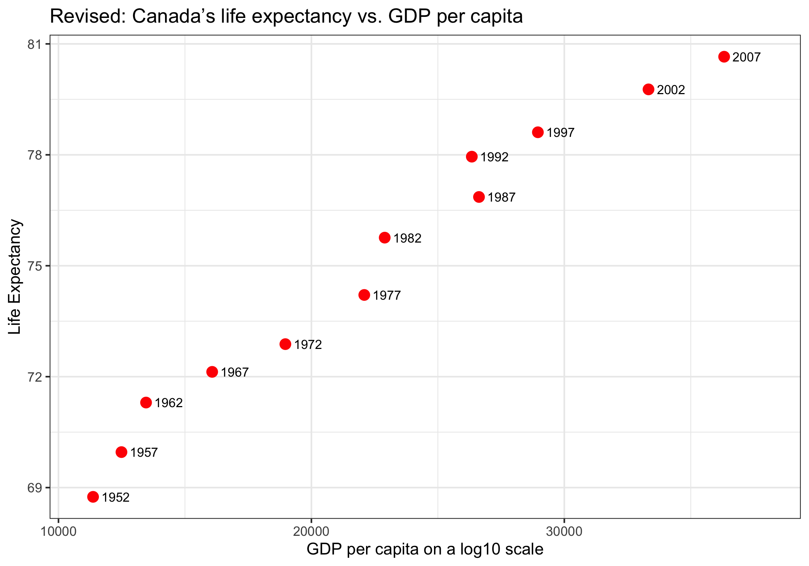

```{r setup, include=FALSE}
knitr::opts_chunk$set(echo = TRUE)
```

## Setup

Some R packages needed in this homework are loaded.

```{r load, warning = FALSE,message=FALSE}
library(gapminder)
library(ggplot2)
library(knitr)
library(tidyverse)
library(ggridges)
library(gridExtra)
library(here)
```

## Exercise 1: Explain the `here::here` package

Below are the some benefits of using here package in R:

1. Easiness of referening sub-directories of a R project: `here` has a root directory of R project location instead of very root directory. Hence, people don't need to add the path to the R project. It increases the reproducibility of the codes. 
2. Allows the code to run even when .r file is in a session outside of the project.
3. OS independent: here package takes care of the finding path when your code is migrated to a different OS (e.g. Windows to Mac). For example, Mac users use "/" to set working directory while Windows users use "\" to set working directory. If they use `here`, they can put the path in quotation marks and elinimate the platform based problem.


## Exercise 2: Factor management

This exercise is to explore `gapminder` dataset and the `continent` variable. First of all, we need to ensurew the variable is indeed a factor. 

```{r}
class(gapminder$continent)
```

### 2.1 Drop Oceania

Filter the Gapminder data to remove observations associated with the continent of Oceania. Additionally, remove unused factor levels. Provide concrete information on the data before and after removing these rows and Oceania; address the number of rows and the levels of the affected factors.

```{r}
nrow(gapminder)
nlevels(gapminder$continent)
levels(gapminder$continent)
```

The original `gapminder` dataset has 1704 rows and 5 levels of `continent`, which are Africa, Americas, Asia, Europe, and Oceania. Next, drop `Oceania` from `continent`. 

```{r}
drop <- gapminder %>%
  filter(continent != "Oceania") %>% 
  droplevels()

nrow(drop)
nlevels(drop$continent)
levels(drop$continent)
```

After dropping `Oceania` from `continent`, we have the new dataset with 1680 rows and 4 levels of `continent`, which are Africa, Americas, Asia, and Europe.

### 2.2 Reorder the levels of `continent`

Use the `forcats` package to change the order of the factor levels, based on summarized information of one of the quantitative variables. Consider experimenting with a summary statistic beyond the most basic choice of the mean/median. Here, reorder the levels of `continent` by using the range of life expectancy for each continent in the year of 2007. 

```{r}
levels(drop$continent)

range <- function(x){
  max(x)-min(x)
}
  
reorder <- drop %>% 
  filter(year == 2007) %>% 
  mutate(continent = fct_reorder(continent, lifeExp, range))

levels(reorder$continent)

reorder %>% 
  group_by(continent) %>% 
  summarize(rangelifeExp = range(lifeExp)) %>% 
  knitr::kable()
```

From the result, we can see that the `continent` is alphabetically ordered originally. After reordering, the new order of the `continent` is Europe, Americas, Africa, and Asia. The range of life expectancy for each continent in the year of 2007 is shown in the table. The change can also be visualized by using plots. 

```{r, message=FALSE, fig.width=10 }
p1<- drop %>% 
  filter(year == 2007) %>% 
  ggplot() +
  geom_boxplot(aes(x = continent, y = lifeExp)) +
  labs(x = "Continent", y = "life Expectancy (in years)", title = "Before Reordering") +
  theme_bw()

p2<- reorder %>% 
  ggplot() +
  geom_boxplot(aes(x = continent, y = lifeExp)) +
  labs(x = "Continent", y = "life Expectancy (in years)", title = "After Reordering") +
  theme_bw()

grid.arrange(p1, p2, nrow = 1)
```

### 2.3 Re-level the `continent`

Comparing the results of arrange on the original and re-leveled factor. We first look at the original data before re-leveling. 

```{r}
ori <- gapminder %>% 
  arrange(continent) 
levels(ori$continent)
```

From the result, `Africa` is the first continent, followed by Americas, Asia, Europe, and Oceania. We now want to re-level the data so that `Europe` is at first.

```{r}
relevel <- gapminder %>% 
  arrange(continent) %>% 
  mutate(continent = fct_relevel(continent, "Europe"))
levels(relevel$continent)
```

After re-leveling, Europe is the first continent, followed by Africa, Americas, Asia and Oceania. Except Europe now is the first continent, the other continents remains the same order as before.

### 2.4 Plot before/after re-leveling `continent`

We can compare the density plot of the life expectancy for each continent before and after re-leveling `continent`. 

```{r, message=FALSE, fig.width=10 }
p1<- ori %>% 
  ggplot(aes(lifeExp, continent, fill = continent)) +
  geom_density_ridges(alpha = 0.7) +
  labs(title = "Life Expectancy by Continent before re-leveling",
       x = "Life Expectancy",
       y = "Continent") +
  theme(legend.position = "none") +
  theme_bw() 

p2<- relevel %>% 
  ggplot(aes(lifeExp, continent, fill = continent)) +
  geom_density_ridges(alpha = 0.7) +
  labs(title = "Life Expectancy by Continent after re-leveling",
       x = "Life Expectancy",
       y = "Continent") +
  theme_bw() 

grid.arrange(p1, p2, nrow = 1)
```

From the plot, we can see that the first continent before re-leveling is `Africa` while the first continent after re-leveling is `Europe`.

## Exercise 3: File input/output (I/O)

### 3.1 Export and reload the dataset

You are expected to create something new, probably by filtering or grouped-summarization of your dataset (for e.g., Singer, Gapminder, or another dataset), export it to disk and then reload it back in using one of the packages above. You should use `here::here()` for reading in and writing out. In this section, a new dataset called `gapminder2007` is created, which is the `gapminder` dataset in the year 2007.

```{r}
gapminder2007 <- gapminder %>% 
  filter(year == 2007) 
write_csv(gapminder2007, here("hw05","gapminder2007.csv"))
```

Now, load the new dataset `gapminder2007` back.

```{r, message=FALSE}
gapminder2007load <- read_csv(here("hw05","gapminder2007.csv"))
```


### 3.2 Factor levels and re-order.

With the imported data, play around with factor levels and use factors to order your data with one of your factors (i.e. non-alphabetically).  To play around `continent` as factor, we need to check `continent` is indeed a factor after reload the dataset. 

```{r}
class(gapminder2007load$continent)
```

From the result, we can see that `continent` is a charactor and no longer a factor after reload the dataset. Hence, we need to change the class of `continent` as a factor.

```{r}
gapminder2007load2 <- gapminder2007load %>% 
  mutate(continent = as.factor(continent))
class(gapminder2007load2$continent)
```

Now, `continent` is a factor. Then, reorder `continent` with respect to the mean life expectancy. The difference between before and after re-ordering can be displayed in the following plots.

```{r, fig.width=10}
p1<-gapminder2007load2 %>% 
  group_by(continent) %>% 
  summarize(meanLifeExp = mean(lifeExp)) %>% 
  ggplot(aes(x=continent, y=meanLifeExp)) +
  geom_point() +
  labs(y = "Mean Life Expectancy",
  x = "Continent", title = "Mean Life Expectancy in 2007 before re-ordering") +
  theme_bw()

p2 <- gapminder2007load2 %>% 
  mutate(continent = fct_reorder(continent, lifeExp, mean)) %>% 
  group_by(continent) %>% 
  summarize(meanLifeExp = mean(lifeExp)) %>% 
  ggplot(aes(x=continent, y=meanLifeExp)) +
  geom_point() +
  labs(y = "Mean Life Expectancy",
  x = "Continent", title = "Mean Life Expectancy in 2007 after re-ordering") +
  theme_bw()

grid.arrange(p1, p2, nrow=1)
```

From the plots we can see that the original order of `continent` is Africa, Americas, Asia, Europe and Oceania. After re-ordering the `continent` with mean of life expectancy in the year 2007, the `continent` is in order of Africa, Asia, Americas, Europe and Oceania.

### 3.3 More thoughts

For the I/O method(s) you chose, comment on whether or not your newly created file survived the round trip of writing to file then reading back in.

```{r}
gapminder2007 %>% 
  DT::datatable(caption = "Exported dataset")
```
```{r, message = FALSE}
gapminder2007load %>% 
  DT::datatable(caption = "Imported dataset")
```

From the above two tables, we can see that there is no difference between two dataset. However, the class type of some variables are changed. Overall, the newly created file survived the round trip of writing to file then reading back in. However, we have to manually change the class type of some variables if we need some sepecifc analysis.

```{r, message=FALSE}
cbind(sapply(gapminder2007, class),sapply(gapminder2007load, class)) %>%
  knitr::kable(col.names = c("Class for the Exported Data", "Class for the Imported Data"))
```

## Exercise 4: Visualization Design

Go back through your previous assignments and class participation activities and find figures you created prior to the last week of the course. Recreate at least one figure in light of something you learned in the recent class meetings about visualization design and color.

Task: Create a side-by-side plot and juxtapose your first attempt (show the original figure as-is) with a revised attempt after some time spent working on it and implementing principles of effective plotting principles. Comment and reflect on the differences.

```{r, fig.width=10, message=FALSE}
p1 <- gapminder %>% 
  filter(country=="Canada") %>% 
  ggplot(aes(x = gdpPercap, y = lifeExp)) + geom_point() +
  labs(y="Life Expectancy", x="GDP per capita on a log10 scale") +
  scale_x_continuous(trans='log10')+
  theme_bw()+
  labs(title = "Original: Canada’s life expectancy vs. GDP per capita") + 
  theme(plot.caption = element_text(hjust = 0.5))

p2 <- gapminder %>% 
  filter(country=="Canada") %>% 
  ggplot(aes(x = gdpPercap, y = lifeExp)) +
  geom_point(size = 3, color = "red") +
  geom_text(aes(label = year), size = 3, hjust=-0.3)+
  labs(y="Life Expectancy", x="GDP per capita on a log10 scale") +
  scale_x_continuous(trans='log10')+
  theme_bw()+
  xlim(11000, 38000)+
  labs(title = "Revised: Canada’s life expectancy vs. GDP per capita") + 
  theme(plot.caption = element_text(hjust = 0.5))+
  theme_bw()

grid.arrange(p1, p2, nrow=1)
```

The original plot is chosen from Assignment 2 Part 1.5. The original assignment can be opened [here](https://github.com/STAT545-UBC-hw-2019-20/stat545-hw-Sihaoyu1220/blob/master/hw02/hw02_gapminder.md#produce-a-scatterplot-of-canadas-life-expectancy-vs.-gdp-per-capita-using-ggplot2-without-defining-a-new-variable.-ensure-gdp-per-capita-is-on-a-log-scale.). The plot shows the association between Canada's life expectancy and GDP per capita. I added a few features to the revised plot. First of all, the small black points in the original plot are very likely to be missed. Therefore, I increase the size of the points and change the color to red. Secondly, in the original plot, it is hard to learn the year corresponding to each point. Therefore, I added the year beside each point. Lastly, I increase the x axis limit in the revised plot in order to fit in all the points and texts.

## Exercise 5: Writing figures to file

Use `ggsave()` to explicitly save the new plot from Exercise 4 to file.

```{r,message=FALSE}
ggsave(here::here("hw05", "New Plot.png"), plot = p2, scale = 1.5,width=5,height=3.5)
```
<center>

</center>

